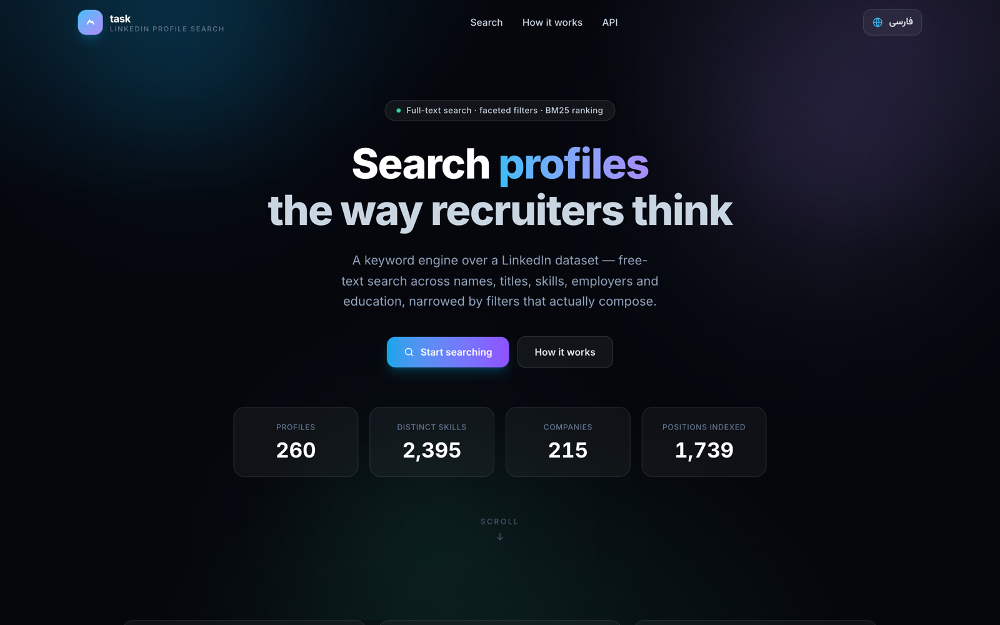
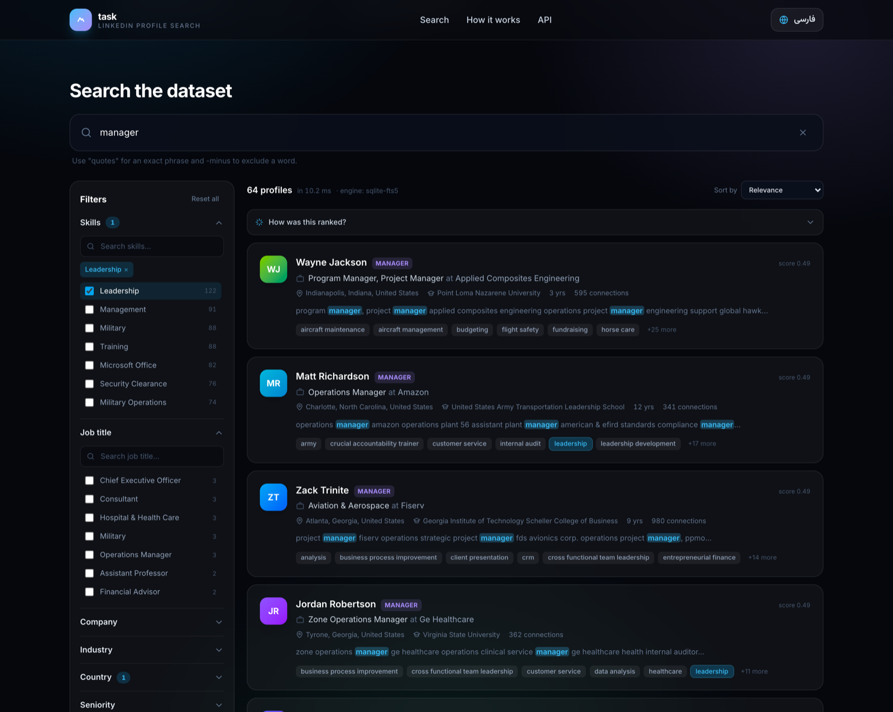
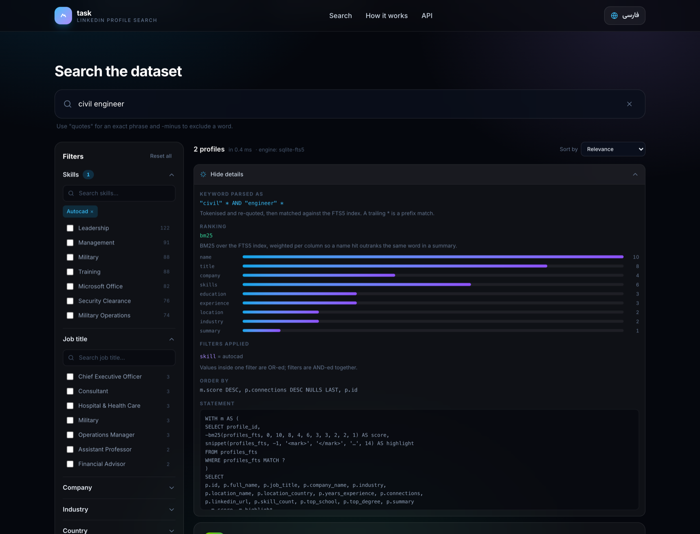
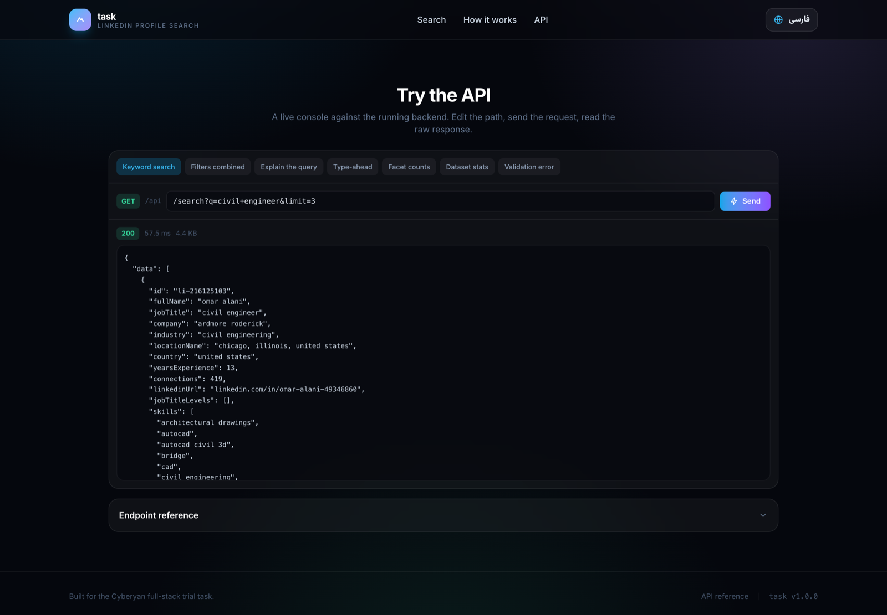
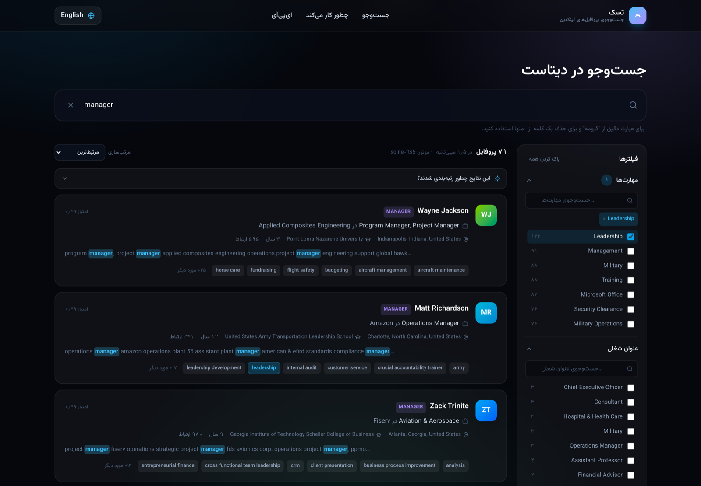
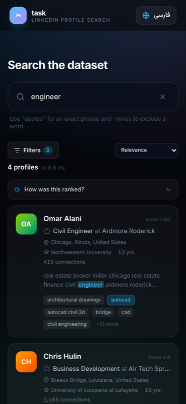
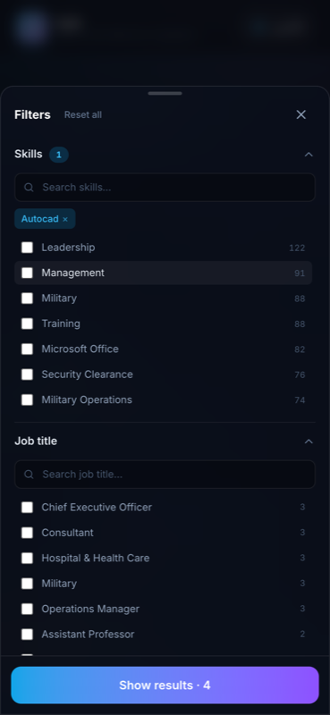

# task — LinkedIn profile search engine

A small web application that searches and filters a LinkedIn profile dataset.
Keyword search, composable filters, and a bilingual (English / فارسی) interface.

> Built for the Cyberyan full-stack trial task.
> **فارسی:** راهنمای فارسی در انتهای همین فایل آمده است — [پرش به راهنمای فارسی](#راهنمای-فارسی).


---

## Screenshots

| | |
| --- | --- |
| **Landing page** | **Search — keyword + filters** |
|  |  |
| Live counters read from `GET /api/stats`. | 64 results in 10 ms. Filter counts, BM25 scores, `<mark>` highlights, clickable skill chips. |
| **“How was this ranked?”** | **Profile detail** |
|  |  |
| The `?explain=1` trace: parsed keyword, BM25 field weights, each filter predicate, the ORDER BY, and the SQL that ran. | Full document from `GET /api/profiles/:id` — every skill, the experience timeline, education. |
| **API console** | **Persian / RTL** |
|  |  |
| Real requests against the running backend — status, timing, size, raw JSON. | The whole layout mirrors, numbers render as Persian digits, Latin data stays left-to-right. |

**Mobile**

<p>
  
  &nbsp;&nbsp;
  
</p>

The filter rail becomes a bottom sheet with its own header and an apply button
carrying the live result count.

---

## Quick start

Requires **Node.js 20+**. Nothing else — no Docker, no database server.

```bash
git clone https://github.com/brainsbalancee/task-.git
cd task-
npm install     # installs both workspaces
npm run ingest  # builds the SQLite database + search index
npm run dev     # API on :4000, UI on :5173
```

Then open **http://localhost:5173**. That is the whole setup — it works on a
fresh clone with no further steps.

### Using the real dataset

The repository ships `data/sample_profiles.csv`, a **synthetic** dataset of 120
profiles in the exact same 77-column format, and the ETL falls back to it
automatically. The dataset supplied with the task is real personal data — names
and employers, plus emails, phone numbers, street addresses and birth dates in
columns this app deliberately ignores — so it is not committed to a public
repository.

To run against the real file, drop it in and re-ingest:

```bash
cp "300 user linkedin.txt" data/linkedin_profiles.csv
npm run ingest
```

The ETL prints which file it used. Everything below describes the real dataset;
the sample behaves identically, just smaller.

| Command | What it does |
| --- | --- |
| `npm run setup` | `npm install` + `npm run ingest` in one step |
| `npm run ingest` | Rebuilds `backend/data/profiles.db` from `data/linkedin_profiles.csv` |
| `npm run dev` | Runs the API and the UI together |
| `npm run build` | Type-checks and builds both for production |
| `npm test` | Runs the backend test suite (45 tests) |
| `npm run sample` | Regenerates the synthetic dataset |
| `npm run es:up` | Starts Elasticsearch (optional — see [Swapping the engine](#swapping-the-search-engine)) |

The frontend calls `/api/*` on its own origin and Vite proxies that to port 4000,
so there is nothing to configure. To point the UI at a different host, set
`VITE_API_BASE_URL`. Backend settings live in `backend/.env` (copy from
`backend/.env.example`); every one has a working default.

---

## Architecture

```
                    ┌───────────────────────────────────────────┐
   data/*.csv  ──▶  │  ETL          repair → normalise → index   │
                    └───────────────────────┬───────────────────┘
                                            │  writes
                                            ▼
                    ┌───────────────────────────────────────────┐
                    │  SQLite     profiles · skills · educations │
                    │             experiences · profiles_fts     │
                    └───────────────────────┬───────────────────┘
                                            │  SearchEngine interface
                                            ▼
                    ┌───────────────────────────────────────────┐
   HTTP/JSON   ◀──▶ │  API        routes → controller → engine   │
                    └───────────────────────┬───────────────────┘
                                            │  fetch
                                            ▼
                    ┌───────────────────────────────────────────┐
                    │  UI         React · debounce · URL state   │
                    └───────────────────────────────────────────┘
```

Three layers, each replaceable without touching the others.

### 1. ETL — `backend/src/etl/`

Turns the supplied CSV into domain objects. Run once via `npm run ingest`; it is
idempotent, so re-running always produces an identical database.

| File | Responsibility |
| --- | --- |
| `dataset-reader.ts` | Repairs the source file and cuts it into records |
| `python-literal.ts` | Parses the Python-literal blobs inside cells |
| `salvage.ts` | Rebuilds records whose columns are misaligned |
| `normalize.ts` | Raw row → `Profile`, plus the text handed to the index |
| `ingest.ts` | CLI: writes the tables and the FTS index |

**The source file needed real repair work.** It is not clean CSV, and reading it
naively silently loses about 16% of the profiles. `npm run ingest` reports
exactly what it did:

```
▸ reading  data/linkedin_profiles.csv
  ├─ injected grep lines removed  58
  ├─ records found                297
  ├─ parsed positionally          58
  ├─ recovered structurally       239
  ├─ unrecoverable                0
  ├─ duplicates collapsed         37
  └─ unique profiles              260
```

Three defects, and how each is handled:

1. **58 lines of grep output were pasted into the file**, e.g.
   `H:\New folder\…\part-00001.csv(2293): Specialties: …`. Each one lands inside
   a record and splits it into fragments. They are stripped, and the fragments
   rejoin.
2. **The file is two exports concatenated** — the header appears twice and 50
   profiles appear in both halves. Records are located by an anchor pattern
   (`name,first,last,gender,linkedin.com/in/…`) rather than by line breaks,
   because field values legitimately contain newlines. Duplicates are collapsed
   by LinkedIn id, keeping the more complete copy.
3. **Most records drop a null column and gain one later**, so the field count
   lands back on 77 while the values in between sit one slot to the left. Field
   *count* therefore does not prove field *alignment*; `isAligned()` verifies the
   shape of columns whose type is known. Misaligned records go through
   `salvage.ts`, which rebuilds them position-independently:
   - the `inferred_salary` column has a unique shape (`85,000-100,000`) and
     appears in every record, so it anchors its neighbours by offset;
   - the Python-literal blobs are self-delimiting and carry signature keys
     (`'company'` → experience, `'school'` → education), so they can be found by
     scanning;
   - the current job, employer and industry are read back from the `is_primary`
     experience entry.

   Every recovered value is shape-checked; anything that fails is left empty
   rather than guessed. `normalize.ts` applies a final guard so a `Profile` can
   never carry a JSON blob where a country name belongs.

Result: **297 records recovered, 0 dropped, 260 unique profiles.**

> Contact fields (emails, phone numbers, street addresses) exist in the source
> but are deliberately not carried into the domain model, indexed, or exposed by
> the API. The task asks for search over professional attributes; the rest is not
> needed to answer it.

### 2. Data model — `backend/src/search/sqlite/schema.sql`

**SQL (SQLite)**, chosen because the data is relational: a profile has many
skills, positions and schools, and the interesting queries are joins across them.

```
profiles ──┬── profile_skills ──── skills      (many-to-many)
           ├── profile_levels                  (seniority)
           ├── profile_degrees                 (education level)
           ├── experiences                     (one row per position)
           ├── educations                      (one row per school)
           └── profiles_fts                    (FTS5 inverted index)
```

Design decisions:

- **Everything filterable is a real, indexed column.** No JSON is scanned at
  query time.
- **Multi-valued attributes are normalised into link tables.** A skill filter is
  an indexed semi-join, and facet counts are a `GROUP BY` instead of 260 array
  scans.
- **`profiles.document` stores the whole domain object as JSON.** The detail
  endpoint is one primary-key lookup, and the ETL stays the only code that knows
  the original CSV shape.
- **The list view is denormalised** (`skill_count`, `top_school`, `top_degree`)
  so rendering a page of results never opens the JSON.

### 3. API — `backend/src/api/`

`routes → controller → SearchEngine`. Controllers only validate input, call the
engine, and shape the response — they never contain SQL, and they depend on the
`SearchEngine` interface rather than on any implementation.

Every request is validated by a Zod schema before a controller sees it, so
handlers work with a typed, bounded query object and invalid input fails with a
field-level 400:

```json
{ "error": { "code": "validation_failed", "message": "Invalid query parameters",
  "details": [{ "field": "limit", "message": "Number must be less than or equal to 100" }] } }
```

### 4. Frontend — `frontend/src/`

React + Vite + Tailwind, with Framer Motion for animation.

- **Debounced** — typing `engineer` fires one request, not eight.
- **Cancelled** — each search aborts the previous one, so a slow response for
  `eng` can never overwrite the results for `engineer`.
- **Sticky results** — the previous list stays on screen (dimmed) while the next
  loads, instead of flashing empty between keystrokes.
- **URL-mirrored** — the full search state lives in the address bar, so any
  search is a shareable link:
  `?q=civil+engineer&skill=autocad&country=united+states&sort=experience_desc`
- **Bilingual** — English/Persian toggle flips `<html dir>`, switches the font
  stack, and renders numbers with Persian digits. State persists across reloads.
- **Type-ahead** — the search box suggests skills, job titles, companies and
  people from `GET /api/suggest`; picking a skill applies it as a filter rather
  than as text, because that is what you meant.
- **“How was this ranked?”** — an inline panel rendering the `explain` trace:
  parsed keyword, BM25 field weights, the exact filter predicates, and the SQL.
- **API console** — the `API` section runs real requests against the backend and
  shows status, timing and raw JSON, so the endpoint surface can be inspected
  without leaving the page.
- **Responsive** — on phones the filter rail becomes a bottom sheet with a
  dedicated header and an apply button; the result count moves to its own row.

---

## Search and filters

### Keyword search

`q` runs against **`profiles_fts`, an FTS5 inverted index**, and is ranked with
**BM25**. Nine fields are indexed separately so the engine can weight them:

| Field | Weight | Field | Weight |
| --- | --- | --- | --- |
| `name` | 10 | `education` | 3 |
| `title` | 8 | `location` | 2 |
| `skills` | 6 | `industry` | 2 |
| `company` | 4 | `summary` | 1 |
| `experience` | 3 | | |

A name match therefore outranks the same word buried in a bio. The response
carries the score and a `<mark>`-annotated snippet around the hit.

The index is declared with `prefix='2 3 4'` (so `engin` matches `engineer`
without a table scan) and `remove_diacritics 2` (so `jose` matches `josé`).

Raw input is never passed to `MATCH`. FTS5 has its own query language, so a
stray quote would throw and hostile input could steer the query. Instead the
input is tokenised and every token is re-quoted, which makes operators inert:

| You type | The engine runs | Meaning |
| --- | --- | --- |
| `golang engineer` | `"golang" * AND "engineer" *` | all terms, prefix-matched |
| `"product manager"` | `"product manager"` | exact phrase |
| `go -recruiter` | `"go" * NOT ("recruiter")` | exclude a term |
| `a" OR "b` | `"or" AND "a" * AND "b" *` | the operator becomes a literal |

### Filters

The task asks for at least two. There are **nine**, and they compose:

| Parameter | Field | Matching |
| --- | --- | --- |
| `skill` | Skills | exact, via the link table |
| `title` | Job title | substring (`engineer` finds `software engineer`) |
| `company` | Employer | substring, current **or** past |
| `industry` | Industry | exact |
| `country` | Country | exact |
| `level` | Seniority (`senior`, `manager`, `cxo`…) | exact |
| `degree` | Degree (`bachelors`, `masters`…) | exact |
| `school` | School | substring |
| `minExp` / `maxExp` | Years of experience | numeric range |

Semantics:

- **OR inside a field** — `skill=go&skill=rust` → *go or rust*
- **AND across fields** — `skill=go&country=germany` → both must hold
- **`skillMatch=all`** flips skills to AND (*every* selected skill required)

Filters narrow the candidate set; the keyword ranks what is left. Both run in a
single SQL statement, so SQLite plans one pass rather than the app fetching rows
and filtering them in JavaScript.

Values are always bound as parameters — no user input is ever concatenated into
SQL. Placeholders are generated from array *lengths*, which is data we control.

### Facets

`GET /api/facets` returns the values for a filter **with their counts**, narrowed
by whatever the user has typed. Filter dropdowns are therefore populated from the
data itself: you can only ever pick a value that returns results, and a field
with 2,395 distinct values (skills) stays usable without shipping any of them to
the client up front.

---

## API reference

Base URL `http://localhost:4000/api`. `GET /api` returns this list at runtime.

### `GET /api/search`

| Parameter | Type | Default | Notes |
| --- | --- | --- | --- |
| `q` | string | — | Supports `"phrases"` and `-exclusions` |
| `skill` `title` `company` `industry` `country` `level` `degree` `school` | string | — | Repeatable or comma-separated |
| `minExp` `maxExp` | number | — | Years of experience |
| `skillMatch` | `any` \| `all` | `any` | |
| `sort` | `relevance` \| `experience_desc` \| `experience_asc` \| `connections_desc` \| `name_asc` | `relevance` | |
| `page` | number | `1` | |
| `limit` | number | `20` | max 100 |

```bash
curl "localhost:4000/api/search?q=civil+engineer&skill=autocad&sort=relevance&limit=2"
```

```json
{
  "data": [
    {
      "id": "li-216125103",
      "fullName": "omar alani",
      "jobTitle": "civil engineer",
      "company": "ardmore roderick",
      "locationName": "chicago, illinois, united states",
      "yearsExperience": 13,
      "skills": ["autocad", "bridge", "cad", "civil engineering"],
      "skillCount": 27,
      "score": 6.17,
      "highlight": "… civil <mark>engineer</mark> ardmore roderick <mark>engineering</mark> …"
    }
  ],
  "meta": { "total": 2, "page": 1, "limit": 2, "pages": 1, "tookMs": 0.42, "engine": "sqlite-fts5" }
}
```

### Other endpoints

| Endpoint | Purpose |
| --- | --- |
| `GET /api/profiles/:id` | Full profile — skills, experience, education |
| `GET /api/facets?field=skills&q=proj&limit=20` | Filter values with counts |
| `GET /api/suggest?q=engin` | Type-ahead across skills, titles, companies, names |
| `GET /api/stats` | Dataset totals |
| `GET /api/health` | Liveness probe |
| `GET /api` | Self-describing index of the whole surface |

### `?explain=1` — see how a search was executed

Search relevance is the easiest thing in an app like this to get subtly wrong
and never notice. Adding `explain=1` to any search returns the trace:

```bash
curl "localhost:4000/api/search?q=civil+engineer&skill=autocad&explain=1&limit=1"
```

```json
{
  "meta": {
    "explain": {
      "keyword": { "input": "civil engineer", "parsed": "\"civil\" * AND \"engineer\" *" },
      "ranking": {
        "function": "bm25",
        "weights": [{ "field": "name", "weight": 10 }, { "field": "title", "weight": 8 }]
      },
      "filters": [{ "field": "skill", "values": ["autocad"], "predicate": "EXISTS (SELECT 1 FROM profile_skills …)" }],
      "filterLogic": "Values inside one filter are OR-ed; filters are AND-ed together.",
      "sort": "m.score DESC, p.connections DESC NULLS LAST, p.id",
      "query": "WITH m AS (SELECT profile_id, -bm25(profiles_fts, 0, 10, 8, …) …"
    }
  }
}
```

It is off by default so the endpoint stays lean. The UI opts in, which is what
powers the **“How was this ranked?”** panel above the results.

---

## Swapping the search engine

The task allows *"Elasticsearch or a simple database search"*. SQLite + FTS5 is
the default because it needs no services, starts instantly, and still gives a
real inverted index with BM25 ranking — which keeps the project runnable with two
commands.

Elasticsearch is implemented too, behind the same interface:

```ts
// backend/src/search/engine.ts
export interface SearchEngine {
  search(query: SearchQuery): Promise<SearchResult>;
  getProfile(id: string): Promise<Profile | null>;
  facets(field: FacetField, opts): Promise<FacetValue[]>;
  stats(): Promise<DatasetStats>;
}
```

`SqliteSearchEngine` and `ElasticSearchEngine` both implement it; `factory.ts` is
the only file that knows which exist. Adding a third (Postgres full-text,
Meilisearch) means writing an adapter and adding one `case`. No controller
changes.

```bash
npm run es:up                                    # start Elasticsearch
npm run ingest --workspace backend -- --elastic  # build the ES index
SEARCH_ENGINE=elastic npm run dev                # serve from Elasticsearch
```

The field weights and query semantics are mirrored between the two adapters, so
the same request returns the same profiles either way. The `engine` field in
every response says which one answered.

> **Status:** SQLite is the path that is built, tested and verified end-to-end
> here — the test suite runs against it and the screenshots come from it. The
> Elasticsearch adapter is complete and type-checks against the official client,
> but it has not been executed on this machine: `docker.elastic.co` is not
> reachable from the network this was developed on, so the image could never be
> pulled. Treat it as reviewed code, not as a verified deployment.

---

## Tests

```bash
npm test
```

41 tests covering the Python-literal parser (including the escaping cases that
break a regex-based approach), the query builder (operator neutralisation,
parameter binding, LIKE escaping, sort tiebreakers), and the engine end-to-end
against the real index — filter composition, `skillMatch` semantics, ranking
order, pagination without overlap, and hostile input.

---

## Project layout

```
task/
├── data/linkedin_profiles.csv     the supplied dataset
├── backend/
│   ├── src/
│   │   ├── api/                   routes, controllers, validation, errors
│   │   ├── domain/                Profile model
│   │   ├── etl/                   repair → normalise → index
│   │   ├── search/
│   │   │   ├── engine.ts          the SearchEngine interface
│   │   │   ├── sqlite/            schema.sql, query builder, adapter
│   │   │   ├── elastic/           mapping, adapter
│   │   │   └── factory.ts         picks the engine
│   │   ├── app.ts  config.ts  index.ts
│   └── tests/
├── frontend/
│   └── src/
│       ├── api/                   typed client + response types
│       ├── components/            hero, search, filters, results, drawer
│       ├── hooks/                 search, facets, debounce, URL state
│       ├── i18n/                  English + Persian, RTL handling
│       └── lib/
└── docker-compose.yml             optional Elasticsearch
```

---
---

# راهنمای فارسی

یک وب‌اپلیکیشن برای جست‌وجو و فیلتر روی دیتاست پروفایل‌های لینکدین.
جست‌وجوی کلیدواژه‌ای، فیلترهای ترکیب‌شونده و رابط دوزبانه (فارسی / English).

## تصویرها

| | |
| --- | --- |
| **صفحهٔ اصلی** | **جست‌وجو با کلیدواژه و فیلتر** |
|  |  |
| **پنل «این نتایج چطور رتبه‌بندی شدند؟»** | **جزئیات پروفایل** |
|  |  |
| **کنسول ای‌پی‌آی** | **نسخهٔ فارسی (راست‌به‌چپ)** |
|  |  |

**موبایل** — ریل فیلترها به یک شیت پایین‌رونده با دکمهٔ اعمال و تعداد زندهٔ نتایج تبدیل می‌شود.

<p>
  
  &nbsp;&nbsp;
  
</p>

## اجرا

نیازمند **Node.js 20 به بالا**. هیچ چیز دیگری لازم نیست — نه داکر، نه دیتابیس سرور.

```bash
npm install     # نصب هر دو ورک‌اسپیس
npm run ingest  # ساخت دیتابیس SQLite و ایندکس جست‌وجو از روی CSV
npm run dev     # API روی ۴۰۰۰ و رابط کاربری روی ۵۱۷۳
```

سپس **http://localhost:5173** را باز کنید.

| دستور | کار |
| --- | --- |
| `npm run setup` | نصب + ساخت ایندکس با یک دستور |
| `npm run ingest` | بازسازی دیتابیس از فایل CSV |
| `npm run dev` | اجرای هم‌زمان بک‌اند و فرانت‌اند |
| `npm run build` | بیلد پروڊاکشن هر دو بخش |
| `npm test` | اجرای ۴۱ تست بک‌اند |

## معماری کلی

سه لایهٔ مستقل: **ETL → دیتابیس → API → رابط کاربری**.

**۱. لایهٔ داده (ETL).** فایل CSV تحویلی تمیز نیست و خواندن سادهٔ آن حدود ۱۶٪ از
پروفایل‌ها را بی‌صدا از دست می‌دهد. سه ایراد وجود دارد و هر سه در `npm run ingest`
گزارش می‌شود:

- **۵۸ خط خروجی `grep`** داخل فایل چسبیده و رکوردها را تکه‌تکه کرده؛ حذف می‌شوند و
  تکه‌ها دوباره به هم می‌پیوندند.
- **فایل از دو خروجی جداگانه تشکیل شده**؛ سطر هدر دو بار آمده و ۵۰ پروفایل تکراری
  است. مرز رکوردها به‌جای شکست خط، با یک الگوی لنگر تشخیص داده می‌شود (چون مقادیر
  فیلدها خودشان شکست خط دارند) و تکراری‌ها بر اساس شناسهٔ لینکدین ادغام می‌شوند.
- **بیشتر رکوردها یک ستون خالی را جا انداخته‌اند** و ستون دیگری اضافه کرده‌اند، پس
  تعداد ستون‌ها دوباره ۷۷ می‌شود ولی مقادیر وسط یک خانه جابه‌جا هستند. بنابراین
  «تعداد ستون درست» به معنی «ترازِ درست» نیست و شکل مقادیر بررسی می‌شود. رکوردهای
  ناتراز از مسیر `salvage.ts` بازسازی می‌شوند: ستون `inferred_salary` شکل یکتایی
  دارد و در همهٔ رکوردها هست، پس به‌عنوان لنگر برای همسایه‌هایش عمل می‌کند؛ و
  بلوک‌های Python-literal با کلیدهای مشخصه‌شان (`'company'`، `'school'`) پیدا
  می‌شوند. هر مقدار بازیابی‌شده اعتبارسنجی می‌شود و در صورت شک، خالی می‌ماند.

نتیجه: **۲۹۷ رکورد بازیابی شد، هیچ رکوردی حذف نشد، ۲۶۰ پروفایل یکتا.**

**۲. ساختار ذخیره‌سازی: SQL (SQLite).** چون داده رابطه‌ای است — هر پروفایل چند
مهارت، چند سابقهٔ شغلی و چند سابقهٔ تحصیلی دارد. هر چیزی که قابل فیلتر است یک
ستون ایندکس‌شدهٔ واقعی است و هیچ JSON‌ای هنگام کوئری اسکن نمی‌شود. مهارت‌ها،
مدارک و سطوح ارشدیت در جدول‌های واسط نرمال شده‌اند تا فیلتر تبدیل به join
ایندکس‌شده و شمارش فیلترها تبدیل به یک `GROUP BY` شود.

**۳. API.** مسیر `routes → controller → SearchEngine`. کنترلرها فقط ورودی را
اعتبارسنجی می‌کنند، موتور را صدا می‌زنند و پاسخ را شکل می‌دهند؛ هیچ SQL‌ای در
کنترلر نیست و وابستگی‌شان به *اینترفیس* موتور است نه به پیاده‌سازی آن. هر درخواست
پیش از رسیدن به کنترلر با اسکیمای Zod اعتبارسنجی می‌شود.

**۴. رابط کاربری.** ری‌اکت با تأخیر کوتاه (debounce) درخواست می‌فرستد، درخواست‌های
قدیمی را لغو می‌کند، نتایج قبلی را تا آمدن نتایج جدید نگه می‌دارد و کل وضعیت
جست‌وجو را در آدرس صفحه نگه می‌دارد تا هر جست‌وجو قابل اشتراک باشد. دکمهٔ تغییر
زبان جهت صفحه (`dir`)، فونت و ارقام (فارسی/لاتین) را با هم عوض می‌کند.

## توضیح سرچ و فیلترها

**جست‌وجوی کلیدواژه‌ای** روی `profiles_fts` اجرا می‌شود — یک **ایندکس معکوس FTS5**
با رتبه‌بندی **BM25**. نُه فیلد جداگانه ایندکس شده‌اند تا وزن‌دهی ممکن باشد:
نام (۱۰)، عنوان شغلی (۸)، مهارت‌ها (۶)، شرکت (۴)، سوابق تحصیلی و شغلی (۳)،
موقعیت مکانی و صنعت (۲)، متن معرفی (۱). پس تطبیق در نام بالاتر از همان کلمه در
متن معرفی می‌نشیند. ایندکس با `prefix='2 3 4'` ساخته شده تا «engin» هم «engineer»
را پیدا کند، و با `remove_diacritics 2` تا «jose» با «josé» تطبیق بخورد.

ورودی کاربر هرگز مستقیم به `MATCH` داده نمی‌شود: FTS5 زبان کوئری خودش را دارد و
یک گیومهٔ اضافه باعث خطا می‌شود. ورودی توکنایز و هر توکن دوباره گیومه‌گذاری
می‌شود تا عملگرها بی‌اثر شوند:

| ورودی کاربر | کوئری اجراشده | معنی |
| --- | --- | --- |
| `golang engineer` | `"golang" * AND "engineer" *` | همهٔ کلمات، با تطبیق پیشوندی |
| `"product manager"` | `"product manager"` | عبارت دقیق |
| `go -recruiter` | `"go" * NOT ("recruiter")` | حذف یک کلمه |

**فیلترها** — تسک حداقل دو فیلتر خواسته بود؛ **نُه** فیلتر پیاده شده است:
مهارت، عنوان شغلی، شرکت، صنعت، کشور، سطح ارشدیت، مدرک تحصیلی، دانشگاه، و بازهٔ
سال‌های سابقه.

منطق ترکیب: مقادیر **درون یک فیلتر با OR** و **فیلترها با هم با AND** ترکیب
می‌شوند. با `skillMatch=all` مهارت‌ها هم به AND تبدیل می‌شوند، یعنی وجود همهٔ
مهارت‌های انتخابی الزامی می‌شود. فیلترها مجموعهٔ کاندیدا را محدود می‌کنند و
کلیدواژه نتیجهٔ باقی‌مانده را رتبه‌بندی می‌کند؛ هر دو در یک دستور SQL اجرا
می‌شوند. همهٔ مقادیر به‌صورت پارامتر bind می‌شوند و هیچ ورودی کاربری داخل متن SQL
قرار نمی‌گیرد.

**مقادیر فیلترها** از `GET /api/facets` می‌آید، همراه با تعداد هر مقدار و
محدودشده به آنچه کاربر تایپ کرده — پس فقط می‌توان مقداری را انتخاب کرد که نتیجه
دارد، و فیلدی با ۲۳۹۵ مقدار یکتا (مهارت‌ها) بدون ارسال همهٔ آن‌ها به مرورگر قابل
استفاده می‌ماند.

## نکته‌ها

- **ElasticSearch یا جست‌وجوی ساده روی دیتابیس؟** هر دو پیاده شده‌اند. پیش‌فرض
  SQLite + FTS5 است چون به هیچ سرویسی نیاز ندارد و پروژه با دو دستور بالا می‌آید،
  ولی همچنان یک ایندکس معکوس واقعی با رتبه‌بندی BM25 است. الستیک‌سرچ پشت همان
  اینترفیس `SearchEngine` پیاده شده و با `SEARCH_ENGINE=elastic` جایگزین می‌شود
  بدون اینکه حتی یک خط از کنترلرها تغییر کند.
  **توجه:** مسیر SQLite کامل ساخته، تست و اجرا شده است. کد الستیک‌سرچ نوشته و
  type-check شده ولی روی این سیستم اجرا نشده، چون `docker.elastic.co` از این شبکه
  در دسترس نبود و ایمیج دانلود نشد.
- فیلدهای تماس (ایمیل، شماره تلفن، نشانی) در دیتاست هست ولی عمداً وارد مدل دامنه،
  ایندکس و خروجی API نشده است؛ برای پاسخ به این تسک لازم نیست.
